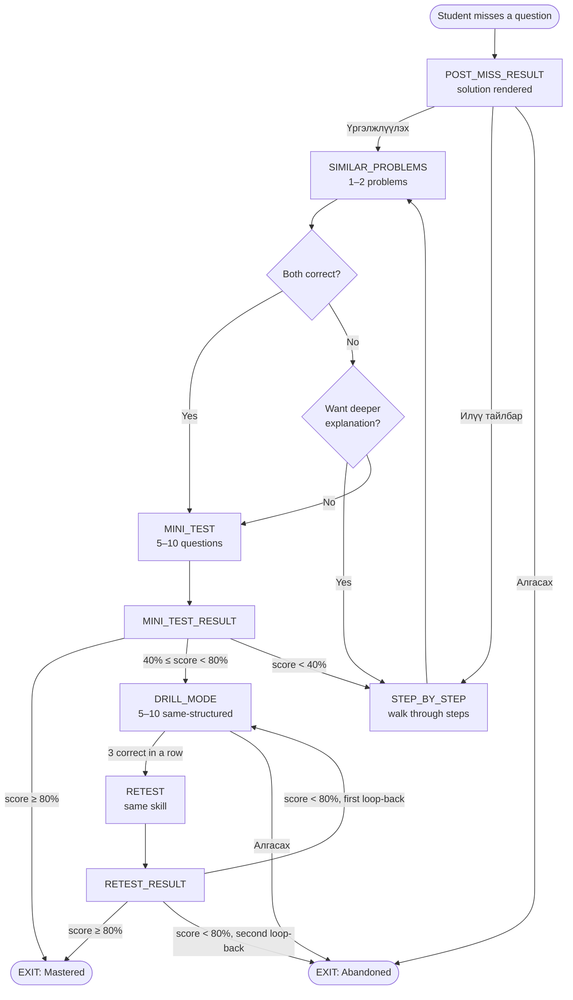

# Refinement loop — architecture design (Phase 3a)

**Date:** 2026-05-13. **Author:** Claude Opus 4.7. **Status:** Draft for Khas review. **No code touched** — this is the planning artefact that locks the architecture before Phase 3b builds it.

## Context

Per `CLAUDE.md`, the refinement loop is the product's differentiator:

> When a student misses #35, they get the solution → similar problems → step-by-step explanation → short topic mini-test → if still uncomfortable, 5-10 same-structured drills → retest → fresh analysis. The promise is *"we will not let you stay weak on a topic."*

Existing surface already covers ~30% of this: missing a question shows the stored `solution` field; the topic-drill page exists; mistakes appear in the analytics mistake library. What's *missing* is the **state machine that takes a student from miss → mastery** without making them re-navigate every screen. This document specifies that state machine.

---

## Section 1 — User states & flow

### What the student moves through

Every loop starts from one entry point: a missed question. From there the student moves through 5 high-level user-facing states, with branching driven by their performance and explicit choices.

| State | What the student sees | Auto-advance or wait? |
|---|---|---|
| 1. **POST_MISS_RESULT** | The question with their wrong answer marked, correct answer shown, the stored `solution` rendered inline. Two prominent buttons: **"Үргэлжлүүлэх"** (continue → similar problems) and **"Илүү тайлбар"** (show step-by-step). A small "Алгасах" (skip) link to abort the loop. | Wait for student. |
| 2. **STEP_BY_STEP** (optional) | The same question, with the multi-step `step_by_step_solution` walked through one step at a time. Each step has a "Дараах" button. Final step ends with "Үргэлжлүүлэх". | Wait per step. |
| 3. **SIMILAR_PROBLEMS** | 1–2 problems pulled from the same skill cohort (Section 4). Same UI as topic-drill: question + 5 options, instant feedback after each, then **"Дараах төстэй бодлого"** or **"Шалгалт хийх"** after both done. | Wait per problem; auto-advance after answer. |
| 4. **MINI_TEST** | 5–10 questions covering the skill, presented like a mini-version of the test runner: progress bar, no instant feedback, submit at end. | Wait. Auto-advance to MINI_TEST_RESULT on submit. |
| 5. **MINI_TEST_RESULT** | Score (e.g. 7/10) + per-question ✓/✗. Three outcomes based on score (see §3): a) ≥80% → EXIT_MASTERED, b) 40–80% → offer DRILL_MODE, c) <40% → offer back-to-STEP_BY_STEP. | Wait for choice. |
| 6. **DRILL_MODE** | 5–10 same-structured problems run sequentially with the existing `hint_progression` (Section 2) escalating after each wrong answer. After 3 correct-in-a-row, prompt **"Шалгалт давтаж өгөх"** (retake the mini-test). | Wait per problem; auto-prompt after streak. |
| 7. **RETEST** | Re-rolls a fresh 5–10 question mini-test on the same skill. Identical UX to state 4. | Auto-advance to RETEST_RESULT on submit. |
| 8. **RETEST_RESULT** → terminal states | One of: **EXIT_MASTERED** (passed), **LOOP_BACK_TO_DRILL** (failed; resets the drill state once), **EXIT_ABANDONED** (opted out at this point). | Terminal. |

### Mermaid flow



### Design notes on flow

- **POST_MISS_RESULT does NOT auto-advance.** Students need time to process the wrong answer. Auto-jumping into similar problems would feel jarring.
- **STEP_BY_STEP is optional, not mandatory.** A confident student who just made a careless mistake shouldn't be forced through 5 steps. They can skip it.
- **The loop can fire from three contexts**, with the same state machine for all three:
  - From the test-runner's submit handler (entry: missed Section 1 question)
  - From the results page (entry: any wrong-answered question, clicked from the mistake panel)
  - From the dashboard's weak-topic recommendation card (entry: implicit "your weakest topic"; the system picks a question to start from)
- **At most one active loop per user.** Starting a new loop while one is in progress prompts a confirm: "Continue [current loop] or start fresh on [new skill]?" Prevents fragmented state.
- **Loop sessions are RESUMABLE.** A student who closes the tab mid-DRILL_MODE returns to the same state on next sign-in. Persisted via `refinement_loop_sessions` (§2).

---

## Section 2 — Data model

### Additions to each `Question`

The existing schema (`lib/esh-questions.ts`) has `source, topic, subtopic, body, options{A..E}, answer, solution, figure?, difficulty: 1–5`. The loop needs:

| Field | Type | Purpose | Consumed by state |
|---|---|---|---|
| `step_by_step_solution` | `string[]` | Ordered list of explanation steps, each one paragraph. Markdown + KaTeX inline. Renders one step per screen tap in STEP_BY_STEP. | STEP_BY_STEP |
| `key_insight` | `string` | One-sentence sentence-summary of what the problem TESTS, not what it asks. Example: *"Энэ бодлого нь рационал илэрхийллийн нэгтгэл сэдвийг шалгаж байна."* Surfaced after the solution to anchor the student conceptually. | POST_MISS_RESULT footer |
| `skill_tag` | `string` (snake_case) | The fine-grained skill the problem trains. Example: `quadratic_formula`, `log_change_of_base`, `prob_dist_expected_value`. **More granular than `subtopic`.** Used as the join key for similar-problem grouping (§4). | SIMILAR_PROBLEMS, MINI_TEST, DRILL_MODE |
| `similar_problem_ids` | `string[]` *(optional)* | Manually-curated `source` ids that are confirmed similar. Overrides skill-tag matching when present. Empty by default; populated only for high-value problems where auto-grouping fails. | SIMILAR_PROBLEMS, DRILL_MODE |
| `difficulty_tier` | `'easy'\|'medium'\|'hard'` | Coarser than the existing `difficulty: 1–5`. Easy = 1–2, medium = 3, hard = 4–5. Used to keep mini-test and drill problems at *uniform* difficulty rather than mixed. | MINI_TEST, DRILL_MODE |
| `hint_progression` | `string[]` *(optional)* | Escalating hints surfaced one-at-a-time on wrong answers during DRILL_MODE. Format: 3 strings. Hint 1 = gentle nudge, Hint 2 = highlight technique, Hint 3 = near-spoiler. Optional — DRILL_MODE falls back to showing the full solution after 3 wrong if hints absent. | DRILL_MODE |

**Encoding choice:** all six fields go directly on the `Question` JSON record. No new file. Optional fields can be omitted on questions that haven't been authored for the loop yet — the loop will gracefully degrade (e.g., a question without `step_by_step_solution` simply hides the "Илүү тайлбар" button).

### New table — `refinement_loop_sessions`

Mirrors the `test_sessions` storage pattern (server-side authoritative; localStorage cache for offline resilience).

```sql
CREATE TABLE public.refinement_loop_sessions (
  id                  UUID PRIMARY KEY DEFAULT gen_random_uuid(),
  user_id             UUID NOT NULL REFERENCES auth.users(id) ON DELETE CASCADE,

  -- Entry context
  triggered_at        TIMESTAMPTZ NOT NULL DEFAULT now(),
  triggered_source    TEXT NOT NULL CHECK (triggered_source IN ('test_submit', 'mistake_panel', 'dashboard_weak_topic')),
  triggered_question  TEXT NOT NULL,        -- the Question.source that caused entry
  skill_tag           TEXT,                  -- denormalised from the triggering question for fast filtering
  topic               TEXT NOT NULL,         -- canonicalised topic key

  -- State machine
  state               TEXT NOT NULL CHECK (state IN (
                        'post_miss_result', 'step_by_step', 'similar_problems',
                        'mini_test', 'mini_test_result', 'drill_mode',
                        'retest', 'retest_result',
                        'exit_mastered', 'exit_abandoned'
                      )),
  state_updated_at    TIMESTAMPTZ NOT NULL DEFAULT now(),

  -- Cumulative progress (append-only)
  similar_attempts    JSONB NOT NULL DEFAULT '[]',  -- [{source, correct, answered_at}, ...]
  mini_test_questions TEXT[] NOT NULL DEFAULT '{}', -- ordered list of source ids
  mini_test_score     INT,                          -- 0..mini_test_questions.length
  drill_attempts      JSONB NOT NULL DEFAULT '[]',  -- [{source, correct, hint_used, answered_at}, ...]
  drill_streak        INT NOT NULL DEFAULT 0,       -- current correct-in-a-row
  retest_questions    TEXT[] NOT NULL DEFAULT '{}',
  retest_score        INT,

  -- Lifecycle
  completed_at        TIMESTAMPTZ,
  exit_reason         TEXT CHECK (exit_reason IN ('mastered', 'abandoned', 'no_content', 'student_skipped')),

  -- Future-proofing
  meta                JSONB NOT NULL DEFAULT '{}'
);

-- One active loop per user is enforced application-side (cheaper than a unique
-- partial index because "active" is a moving target across many states).
CREATE INDEX refinement_loops_user_active_idx
  ON public.refinement_loop_sessions (user_id, state_updated_at DESC)
  WHERE completed_at IS NULL;

CREATE INDEX refinement_loops_user_completed_idx
  ON public.refinement_loop_sessions (user_id, completed_at DESC)
  WHERE completed_at IS NOT NULL;

-- RLS: same pattern as attempts / section2_attempts.
ALTER TABLE public.refinement_loop_sessions ENABLE ROW LEVEL SECURITY;
CREATE POLICY "user reads own loops" ON public.refinement_loop_sessions
  FOR SELECT USING (user_id = auth.uid());
CREATE POLICY "user writes own loops" ON public.refinement_loop_sessions
  FOR INSERT WITH CHECK (user_id = auth.uid());
CREATE POLICY "user updates own loops" ON public.refinement_loop_sessions
  FOR UPDATE USING (user_id = auth.uid());
```

### Lifecycle

```
INSERT row with state='post_miss_result'
    ↓
UPDATE state through the flow (each transition rewrites state + state_updated_at)
    ↓ (per-state updates append to similar_attempts / mini_test_questions /
       drill_attempts / etc. as the student progresses)
    ↓
UPDATE completed_at + exit_reason on terminal state
```

Append-only progress columns (`similar_attempts`, `drill_attempts`, `mini_test_questions`, `retest_questions`) make the audit trail trivially reconstructible — "show me everything user X did in their last loop on topic Y" is a single SELECT.

### What the existing `attempts` table records

Every problem the student answers during the loop ALSO writes to `attempts` (with `source='drill'` for SIMILAR_PROBLEMS and DRILL_MODE; `source='test'` for MINI_TEST and RETEST). This means:
- The weak-topic recommendation card (`getTestOnlyTopicStats`) only counts mini-test + retest, not similar/drill — keeps the signal honest.
- The mistake library still shows every wrong answer regardless of context.

---

## Section 3 — Triggering rules

### When does the loop fire?

Three triggers, each with its own threshold:

#### 3a. Auto-trigger from test submission

After the test-runner's submit handler grades Section 1, identify the *single weakest skill_tag* the student demonstrated in this test:

- Group the test's missed questions by `skill_tag`
- For each skill_tag, compute `miss_rate = misses / total_questions_with_this_tag_in_test`
- Pick the skill_tag with the highest miss_rate, ties broken by absolute miss count
- If `miss_rate ≥ 0.5` AND at least 2 missed questions in the skill, **auto-enter the loop** on the first missed question of that skill

Rationale: every-miss triggering would create loop fatigue (a test has 36 questions; even strong students miss 5). Triggering on a clear weakness signal makes the loop feel useful, not nagging.

#### 3b. Manual trigger from results page or mistake panel

Every missed question has a **"Тогтоох" (master this)** button. Click → loop fires on that question regardless of test-level miss rate.

Rationale: the auto-trigger picks one skill per test, but students often want to drill multiple. Manual is the escape hatch.

#### 3c. Auto-trigger from dashboard's weak-topic recommendation card

Once a week, when the dashboard's recommendation card surfaces a weak topic (driven by `getTestOnlyTopicStats`, accuracy <70%), it gets a **"Энэ сэдэв дээр сурлаа"** (start training on this topic) button. Click → loop fires on the easiest unsolved problem in that topic.

Rationale: students who don't take tests often won't hit 3a. The dashboard card is the catch-net.

### Branching thresholds inside the loop

These decide whether the student goes to SIMILAR_PROBLEMS or skips ahead, and whether MINI_TEST_RESULT triggers DRILL_MODE.

| Decision point | Threshold | Defaults |
|---|---|---|
| Number of similar problems shown | 2 if `skill_tag` cohort has ≥3 problems; 1 if cohort has 1–2; **skip to mini-test** if cohort = 0 | 2 |
| Mini-test question count | 5 if skill_tag cohort has ≥10 problems available (excluding ones the student saw recently); 10 if cohort is small (5–9) | 5 |
| Mini-test pass threshold | 80% (4 of 5 or 8 of 10) | 80% |
| Mini-test mid-tier (offer drill) | ≥40% AND <80% | 40%–80% |
| Mini-test very-low (recommend step-by-step) | <40% (the student didn't understand the concept; sending them to drills won't help yet) | <40% |
| Drill-mode "ready for retest" trigger | 3 correct in a row | 3 |
| Drill-mode "give up gracefully" | 5 wrong in a row OR 15 total attempts without 3-streak | 5 / 15 |
| Retest pass threshold | Same as mini-test: 80% | 80% |
| Retest cap before EXIT_ABANDONED | 2 (i.e., one retest attempt; if that fails, mark abandoned and offer the loop again 7+ days later) | 2 |

### When does "5–10 same-structured drills" trigger vs "1–2 similar problems"?

**Per Khas's brain dump**, the distinction is:

- **Similar problems** (state 3) = same skill_tag, *different* parameters. Tests if the student got it via the solution explanation.
- **Drill mode** (state 6) = same skill_tag, *near-identical* structure (e.g., 5 quadratic-formula problems all with integer coefficients). Builds the muscle memory.

The data model supports both via `skill_tag` + `difficulty_tier`. Similar-problems sampling uses `skill_tag` only (any difficulty). Drill mode uses `skill_tag` + `difficulty_tier` = same as the triggering question.

### 3d. Section 2 manual entry only

Auto-triggers (3a, 3c) operate on Section 1 questions only — they have a clean `skill_tag` and an unambiguous miss signal (right letter vs wrong letter). Section 2 problems are intentionally multi-skill (a single problem spans 3–5 subproblems, each potentially exercising a different sub-skill), so they don't fit the auto-trigger model cleanly.

**Manual trigger remains available on Section 2.** The mistake-panel entry point (3b) renders Section 2 misses alongside Section 1 misses, each with a Тогтоох button. Clicking it on a Section 2 problem enters the loop using the problem's denormalized `skill_tag` — the dominant skill in the problem's main question stem, chosen by the content author at tagging time. Accept that this denormalization is lossy: a Section 2 problem that exercises "integration_by_substitution" + "definite_integral_bounds" picks one tag, and similar-problem matching will be cohort-matched on that one. Manual override via `similar_problem_ids` is available if the cohort match is bad.

### Design note: skills with <2 instances per test

A skill_tag that appears on fewer than 2 questions per test cannot satisfy 3a's auto-trigger condition (`miss_rate ≥ 0.5 AND ≥2 missed questions in skill`). These skills are **manual-trigger only** by design — surfacing them requires the student to open the mistake panel and Тогтоох a single miss. Known consequence: rare-skill weaknesses (e.g., a tag that lands on only one question per test) will never auto-train. Accepted trade-off — the alternative is too-noisy auto-trigger on single misses.

### Retest pool exhaustion fallback

When a student reaches RETEST and the remaining `skill_tag` pool (excluding both the mini-test's questions and any prior retest's questions) has fewer than 5 questions available, the retest falls back to **reusing questions oldest-attempted-first**. Reuse is logged in the session row:

```
UPDATE refinement_loop_sessions
   SET meta = meta || '{"retest_pool_exhausted": true}'::jsonb
 WHERE id = ?
```

Surfaces in analytics so we can prioritize authoring more content for over-trained skills. Doesn't change exit criteria — passing a re-used retest at ≥80% still counts as mastery.

---

## Section 4 — Similar-problem grouping

### The three approaches

**A. Manual `similar_problem_ids` curation.** Per-question authored list. Highest quality (a human picked them) but highest cost — for 1,724 Section 1 questions, authoring 5 similar per question is ~8,000 entries with cross-references.

**B. Auto-grouping by `skill_tag` + `difficulty_tier`.** Group all questions by `skill_tag` and within each group filter by difficulty_tier when needed. Cheap to query (`SELECT * FROM questions WHERE skill_tag = $1 AND source != $2`). Quality depends on skill-tag consistency.

**C. LLM-generated similarity at runtime.** Each request sends the source question's body to a model and asks it to pick 5 similar from the pool. Most flexible, but $$ per request and unstable (no two LLM calls return the same set).

### The pick: Hybrid B + A (B primary, A as override)

**Primary path: B (skill_tag + difficulty_tier auto-group).**

- Most questions get matched algorithmically — no authoring overhead
- Quality is "good enough" if `skill_tag` is granular (e.g., `factoring_diff_of_squares` not just `algebra`)
- Migration to A is incremental: any question can grow a `similar_problem_ids` field and it overrides B automatically

**Override path: A (manual curation).**

- For tricky questions where skill-tag matching gives bad similars (e.g., a problem that combines two skills — `skill_tag` is necessarily reductive)
- Authored on demand, not bulk
- Field is `string[]` of source ids; empty by default

**Why not C:** LLM cost and instability disqualify it from the primary path. We may use C *offline* to pre-compute candidate `similar_problem_ids` lists that a human reviews — that's an authoring tool, not a runtime path.

### Migration path

Phase 3b (next): tag every Section 1 question with `skill_tag` + `difficulty_tier`. Builds B. Ship.

Phase 3c (later, if quality complaints): for the top-20 most-missed skills, an LLM pre-compute pass surfaces candidate `similar_problem_ids` for human review. Author the overrides as we go.

Phase 4 (if ever): a true vector-similarity model trained on question embeddings. Out of scope until the loop is proven valuable.

---

## Section 5 — When can the student exit?

### "Mastered" exit (the happy path)

Two paths to EXIT_MASTERED:

1. **MINI_TEST passes with ≥80%.** Confident enough to skip drills. Loop closes. Topic gets a 7-day cool-down (won't auto-trigger again from 3c during that window).
2. **RETEST passes with ≥80%** after DRILL_MODE. The harder path. Topic gets a 14-day cool-down (longer because the student needed the drills). If the retest drew from a pool-exhausted fallback (see §3, `meta.retest_pool_exhausted = true`), the mastery still counts — but the analytics dashboard flags the skill for "needs more content" so authoring can prioritize it.

### "Abandoned" exit (the unhappy path)

Three triggers:

1. **Student explicitly clicks Алгасах** at any state. Honest exit. Topic gets a 3-day cool-down (don't immediately re-suggest; respect the choice).
2. **Two failed retests within the same loop.** System bails gracefully: *"Энэ сэдэв одоохондоо хэцүү байна. 7 хоногийн дараа дахин оролдоорой."* (This topic is hard for you right now. Try again in 7 days.) Topic gets a 7-day cool-down.
3. **Loop is dormant for 30 days** (no `state_updated_at` activity). Auto-marks abandoned. The next time the student visits the dashboard, the loop is offered as a "Continue or restart?" prompt.

### What "no longer weak" means for analytics

The `weak-topic` filter on the dashboard (currently `t.accuracy < 70%` on test-only stats) should be augmented with:

- **Recently mastered** flag: if the student has EXIT_MASTERED on this topic's main skill within the last 14 days, the topic doesn't surface as weak on the dashboard *even if* the underlying accuracy is still <70%. (Rationale: stats lag the actual learning. Give the student credit for the work they just did.)
- **Mastered streak** display: show a small ✓ + "Тогтоосон" (mastered) badge next to topics with active mastery flags.

### Edge cases

- **Student passes mini-test 80% but with 1 missed question — should drill cover that miss?** No. The exit threshold is a threshold, not a perfectionism check. Re-entering the loop for that single miss would be punitive. Honor the threshold.
- **Student skips the loop, then immediately misses another question on the same skill.** The 3-day cool-down only suppresses *auto*-triggers. The student can still manually trigger via the Тогтоох button.
- **Student finishes the loop but their stats still show the topic as weak** (because the loop's problems are too few to flip the average). The "Recently mastered" flag handles this — the dashboard doesn't shame the student.

---

## Section 6 — Open questions for Khas

These need your decisions before Phase 3b implementation.

1. **Authoring language for `step_by_step_solution` and `hint_progression`.** Mongolian-only (matches all current content), or bilingual (matches the analytics + landing-page pattern)? **Default proposal: Mongolian-only at launch, bilingual later if K-12 expansion needs it.**

2. **Block other practice while a loop is active, or run alongside?** Blocking is more focused but feels coercive. Running alongside risks the loop being abandoned mid-flow. **Default proposal: run alongside, with a small badge on the dashboard "Сурлаа: [skill_tag] · Үргэлжлүүлэх"** so the student remembers.

3. **Mini-test question pool source.** Three options:
   - (a) Pull from the existing 1,724 Section 1 questions filtered by skill_tag
   - (b) Author a dedicated mini-test bank (cleaner pool, but lots of new content)
   - (c) Generate via LLM at runtime (cheap, but quality risk)
   **Default proposal: (a) — reuse existing content. The LLM authoring tool we'd build for (c) is better-spent on hint_progression.**

4. **"Same-structured" drills — parametric variations or just same skill_tag/difficulty_tier?** Parametric variations (e.g., quadratic with new coefficients per problem) require a problem generator. Same-skill-tag works with existing content. **Default proposal: same-skill-tag at launch; build a parametric generator later if students complete drills too quickly without learning.**

5. **Premium gating.** Is the refinement loop a free-tier feature or Premium-only? The free tier already has the past papers; gating the loop signals it as the *paid* differentiator. **Default proposal: free tier at launch for product-market-fit validation, Premium-tier after first 100 paying users to test conversion.**

6. **Skill-tag granularity.** How fine? `algebra` is too coarse; `factoring_quadratics_with_leading_one` is too narrow. **Default proposal: ~50–80 distinct skill_tags total, granularity around the level of "factoring_quadratics" / "log_change_of_base" / "vector_dot_product".**

7. **Skill_tag authoring cost.** Tagging 1,724 questions is real work — manual review is ~30 sec/q = ~14 hours. An LLM pre-classify + human review is ~5 hours. **Decision (locked 2026-05-13):** LLM pre-classify emits a **confidence score per tag**; tags with `confidence < 0.7` auto-route to manual review regardless of skill. Independent of the "top-20 most-missed" spot-check, which is additive. This guarantees the riskiest classifications get human eyes without blanket-reviewing the high-confidence ones.

8. **Daily loop-time cap.** Should we enforce a per-day cap to prevent fatigue (e.g., "Today you've worked through 3 loops; come back tomorrow")? **Default proposal: no cap for now; revisit if metrics show diminishing returns.**

9. **Cross-loop signal sharing.** If a student passes a loop on `factoring_quadratics`, does that affect their weak-topic ranking for `quadratic_formula` (a related skill)? Build a skill-graph or treat them independently? **Default proposal: independent at launch. A skill-graph is a Phase 5 problem.**

10. **Section 2 (fill-in problems) — is the loop scope Section 1 only, or do Section 2 misses also trigger?** Section 2 problems are multi-skill and don't have a clean `skill_tag`. **Decision (locked 2026-05-13):** auto-trigger stays Section-1-only. Students can manually trigger the loop on Section 2 main problems via the Тогтоох button in the mistake panel. Each Section 2 problem gets a single denormalized `skill_tag` (the dominant skill in the problem's main question stem) for cohort matching — accept the lossiness. See §3d.

11. **Retest content — same questions as the mini-test or a fresh draw?** Same questions = direct comparison; fresh draw = harder to game. **Decision (locked 2026-05-13):** fresh draw from the same skill_tag pool, excluding the mini-test's questions. **Fallback:** if the pool is exhausted (mini-test + any prior retests used up the unique questions), allow reuse oldest-attempted-first and log `meta.retest_pool_exhausted = true` for analytics. See §3.

12. **Analytics events.** What product-validation telemetry should the loop emit? **Decision (locked 2026-05-13):** at minimum:
    - `loop_triggered` (source: `test_submit` | `mistake_panel` | `dashboard_weak_topic`)
    - `loop_state_changed` (from, to)
    - `loop_solution_viewed` (fires when student clicks "Илүү тайлбар" and advances past the first step of STEP_BY_STEP — distinguishes engaged vs accidental-click)
    - `loop_hint_viewed` (Phase 3d when `hint_progression` is wired — fires per hint level revealed)
    - `loop_exited` (reason, duration_ms, attempts_total, mini_score, retest_score)
    Used to validate that the loop actually moves students from weak → mastery, and to find drop-off points (e.g. high abandon rate after MINI_TEST → DRILL means drills are too hard).

13. **Per-state Mongolian copy.** Every state in §1 has placeholder MN text in this doc. Need polish + tone consistency with the rest of the product. Likely an authoring pass after Phase 3b builds the state machine.

14. **Auto-trigger 3a's threshold.** The "miss_rate ≥ 0.5 AND ≥2 missed questions in skill" condition is tuneable. **Default proposal: ship with this, log how often it fires per test, tune based on data after first 100 user-tests.**

---

## Phase 3 sequencing summary

- **Phase 3a (this doc):** design. STOPPED here.
- **Phase 3b (next gate):** content audit + tagging. Add `skill_tag`, `difficulty_tier` to existing 1,724 Section 1 questions. Author `key_insight` and `step_by_step_solution` for a starter subset (proposal: 200 most-missed questions). Skip `hint_progression` initially.
- **Phase 3c:** state machine implementation. `refinement_loop_sessions` table, the state-machine TypeScript module, the 8 user-facing states from §1.
- **Phase 3d:** trigger integrations. Wire 3a/3b/3c entry points. Cool-down logic. Recently-mastered flag in analytics.
- **Phase 3e:** telemetry + iteration. Land event tracking; review first cohort's loop completion rates; tune thresholds.

Each phase has its own gate. No work on 3b until Khas resolves the §6 open questions.
